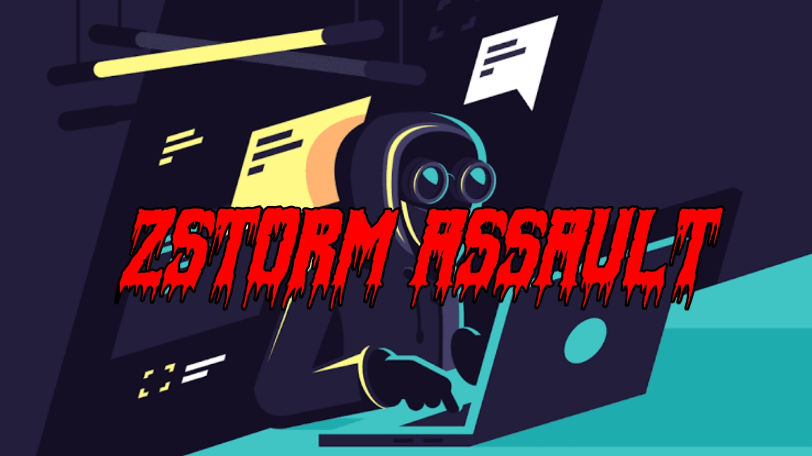

# <span style="color:red">ZSTORM ASSAULT</span>

---



---

## **DDoS LAYER7 POST ATTACK WITH PAYLOAD (PREMIUM VERSION)**

### **How To Run:**

1. **Clone this repository:**
    ```bash
    git clone https://github.com/ridhosec1337/zstorm-assault
    ```

2. **Navigate to the zstorm-assault directory:**
    ```bash
    cd zstorm-assault
    ```

3. **Install the required dependencies using pip3:**
    ```bash
    sudo pip3 install -r requirements.txt
    ```

4. **Run the program with Python 3:**
    ```bash
    python3 main.py
    ```
